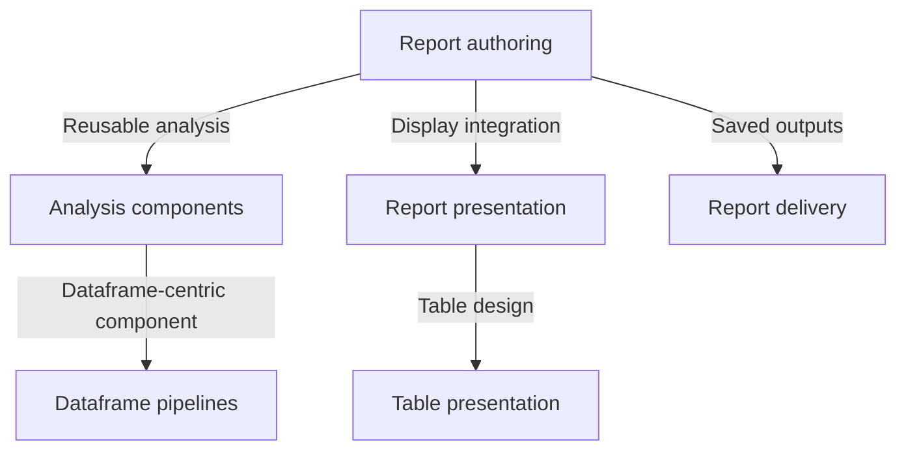

# Ask Aesthetic Taste

Route work within the [Aesthetic Taste mission](../../../README.md#mission):
turn data into evidence that people can understand, question, and act on.
This router owns task selection; linked skills and documents own their rules.
It is repository-scoped. Meaning-layer prototypes and notebook environments
remain separate areas in the [repository map](../../../README.md#repository-map).

## Choose an entry point

- Create or revise report code, section dependencies, or a live notebook:
  use [report-authoring](../report-authoring/SKILL.md).
- Turn a concrete analysis into a reusable component, or revise its input,
  output, and configuration contract: use [analysis-components](../analysis-components/SKILL.md).
- Design or review meaning, validation scope, or named computations inside a
  dataframe-centric component: use [dataframe-pipelines](../dataframe-pipelines/SKILL.md).
- Change reading navigation, Mermaid, or notebook/HTML display integration:
  use [report-presentation](../report-presentation/SKILL.md).
- Design or review a table: use [table-presentation](../table-presentation/SKILL.md).
- Produce saved outputs, check an existing bundle, or diagnose a browser failure:
  use [report-delivery](../report-delivery/SKILL.md).

## Compose only what the task needs

Each node is also a direct entry point. These links are conditional, not required
stages. Component design, dataframe pipelines, and table design can be used without
building a report.
Delivery supports both a new build and verification of an existing artifact.

## Shared references

Read the [report model](../../../docs/report-model.md) when terms or responsibility
boundaries matter. Read the [report contract](../../../docs/report-contract.md)
for observable guarantees. Read [CLI design](../../../docs/report-cli-design.md)
for tool and artifact behavior. Load each reference when the task needs it.

Routing is complete when the selected skill owns the requested result. For work
outside these report skills, follow the repository map rather than extending
report constraints to the whole mission.
