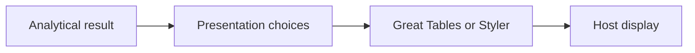

# Renderer guidance

Use this reference when choosing or implementing Great Tables or pandas Styler.
The [table presentation skill](../SKILL.md) owns the design guidance.
This reference owns renderer choices and examples, not a shared package contract.
The API guidance below dates from September 2026; check the installed version
and upstream references before using version-sensitive features.

### Choose the smallest sufficient native path

Great Tables names publication parts directly and accepts pandas or Polars data
([GT](https://posit-dev.github.io/great-tables/reference/GT.html)). Styler follows
pandas axes and exposes CSS and custom HTML templates
([Styler](https://pandas.pydata.org/docs/reference/api/pandas.io.formats.style.Styler.html),
[templates](https://pandas.pydata.org/docs/reference/api/pandas.io.formats.style.Styler.from_custom_template.html)).
Great Tables is more structured, but it also supports custom formatting and CSS.
Choose by how much custom code the intended design needs, not a universal
flexibility ranking.

Start with a function returning a native `GT` or `Styler`. Reuse existing themes
and APIs before adding wrappers. Introduce a shared abstraction only for observed
repetition.

Neither normal static path supplies a complete sortable, filterable, virtualized
grid. Choose a grid renderer when required; Python formatting callbacks do not
become browser callbacks.

### Keep ownership clear



The analytical result owns values, units, identity, uncertainty, aggregates, and
provenance. Presentation choices own order, labels, grouping, formats, and
emphasis. Select by stable fields and raw-value conditions, not incidental row
positions. Change labels only in the display view.

The renderer owns HTML/CSS; the host owns embedding and overflow. Scope styles
to each table and give each instance a distinct DOM identity. Keep common
appearance in a theme function and measure formats beside their meanings.
Keep package mechanics in upstream API references; this guide owns judgment.

### Map intent to native APIs

| Intent | Great Tables | pandas Styler |
| --- | --- | --- |
| Title and scope | `tab_header()` | `set_caption()`; host subtitle |
| Row identity and groups | `rowname_col`, `groupname_col` | Named index / MultiIndex; styles for group separators |
| Column hierarchy and labels | `tab_spanner()`, `cols_label()` | Column MultiIndex, `relabel_index()` |
| Numeric / missing formats | `fmt_*()`, `sub_missing()` | `format()`, `format_index()`, `na_rep` |
| Local styles and group fills | `tab_style()` with `loc.*`, `style.*` | `map()`, `apply()`, `set_td_classes()` |
| Heatmaps | `data_color()` | `background_gradient()` |
| In-cell charts | `fmt_nanoplot()` | `bar()`; authored SVG/HTML for sparklines |
| Icons and images | `fmt_icon()`, `fmt_image()` | Authored HTML formatter / template |
| Theme | `tab_options()`, `opt_*()`, `pipe()` | `set_table_styles()`, `set_properties()`, `pipe()` |
| Notes | `tab_footnote()`, `tab_source_note()` | Host text / maintained template |
| HTML output | `as_raw_html()` | `to_html()` |

These are equivalent intentions, not identical markup
([Great Tables API](https://posit-dev.github.io/great-tables/reference/),
[Styler API](https://pandas.pydata.org/docs/reference/api/pandas.io.formats.style.Styler.html)).
Great Tables' [nanoplots](https://posit-dev.github.io/great-tables/reference/GT.fmt_nanoplot.html)
are experimental; check scales and missing-data behavior in the installed version.
Its `fmt_percent()` scales proportions by default; use `scale_values=False`
for already scaled percentages
([formatting](https://posit-dev.github.io/great-tables/reference/GT.fmt_percent.html)).

### Worked example: one result, two display paths

This synthetic result compares two methods. Rates are stored as proportions;
the missing rate means no estimate is available. Both paths must preserve the
row order, labels, units, and missing-value definition. Matching pixels is not
required.

```python
import pandas as pd

result = pd.DataFrame({
    "method": ["Baseline", "Candidate"],
    "n": [1200, 1180],
    "rate": [0.123, float("nan")],
})
title = "Method comparison — synthetic data"
note = "Source: inline synthetic fixture. — = estimate unavailable."
```

Great Tables names each publication part directly:

```python
from great_tables import GT

gt_table = (
    GT(result, rowname_col="method")
    .tab_header(title=title)
    .tab_stubhead(label="Method")
    .tab_spanner(label="Outcome", columns=["n", "rate"])
    .cols_label(n="Observations", rate="Event rate (%)")
    .fmt_integer(columns="n")
    .fmt_percent(columns="rate", decimals=1)
    .sub_missing(columns="rate", missing_text="—")
    .cols_align(align="right", columns=["n", "rate"])
    .tab_source_note(source_note=note)
)
```

For Styler, shape a presentation copy and use its column hierarchy:

```python
view = result.set_index("method").copy()
view.index.name = "Method"
view.columns = pd.MultiIndex.from_tuples([
    ("Outcome", "Observations"),
    ("Outcome", "Event rate (%)"),
])
styled_table = (
    view.style
    .set_caption(title)
    .format({
        ("Outcome", "Observations"): "{:,.0f}",
        ("Outcome", "Event rate (%)"): "{:.1%}",
    }, na_rep="—", escape="html")
    .set_properties(**{"text-align": "right"})
    .set_table_styles([
        {"selector": "th.row_heading", "props": [("text-align", "left")]},
        {"selector": "th.col_heading", "props": [("text-align", "right")]},
        {"selector": "caption", "props": [("text-align", "left")]},
    ])
)
```

Display `gt_table` directly in a notebook. Display `styled_table` with `note`
immediately below it. When exporting Styler, use `to_html(sparse_columns=True)`
to retain the spanner, and include the same note in the host's table component.
Store that note once; each display path consumes it.

For external text, define escaping at the rendering boundary. Styler supports
HTML escaping in formatters; escape index labels too when they contain external
text. Treat explicit HTML or Markdown helpers as authored markup. The synthetic
labels here are fixed source text
([formatting and escaping](https://pandas.pydata.org/docs/user_guide/style.html)).

### Verification scope

The unchanged example blocks passed API and HTML-content checks on 2026-09-06
with Great Tables 0.24.0 and pandas 3.0.5. Both retained 12.3%, the missing marker,
row labels, and a two-column spanner; source values stayed unchanged. This evidence
does not establish notebook/browser layout, accessibility, or export parity.
