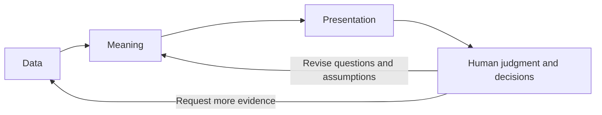

# Aesthetic Taste

Aesthetic Taste develops tools and design guidance for business decisions informed
by both human judgment and data. As agents reduce the cost of analysis and
implementation, choosing useful questions, interpreting evidence, and organizing
work deserve more attention.

## Mission

Help people and agents turn data into evidence that people can understand,
question, and act on. Intuition and taste guide what to investigate and which
tradeoffs matter. Data tests those expectations and helps people revise them.

Visual interfaces are a central part of this work. Good presentation makes
patterns, comparisons, uncertainty, and assumptions easier to see. We aim for
interfaces that are visually coherent and rich in useful information, with clear
hierarchy and detail available when needed. Beauty earns its place by helping
people think.

## Governing scope

The repository follows three connected layers:



The **data layer** owns records, storage, and computation engines. We build on
established tools here. The **meaning layer** makes interpretation explicit:
what data represents, which assumptions and rules apply, and how computations
preserve that meaning. The **presentation layer** makes evidence available for
human inspection through reports, notebooks, and interactive dashboards.

Our main design work sits in the meaning and presentation layers, and in the
connections between them. We develop small, composable libraries and workflows
that people and agents can use together. We judge them by how clearly their APIs
express intent, how much they can express, how easily one part can change, and
whether their output artifacts support further inspection and work.

A useful result includes both a readable interface and artifacts that agents can
inspect and modify: data, source, configuration, provenance, and execution
results. Presentation must remain connected to that evidence. Visual polish
alone cannot establish that an analysis is correct.

Reports, reusable analysis components, semantic data tools, validation, and
notebook environments belong here when they support this decision process.
Research examples test these ideas against concrete problems. This repository
does not aim to replace general data engines, build a complete business platform,
or prescribe how every business decision should be made.

The work spans research and reusable tooling. The installable package currently
provides `report`: a command-line workflow from Jupytext source to an executed
notebook, Quarto HTML, an artifact inventory, and optional browser verification.
The map below identifies the other areas and their stages of development.

## Repository map

For a task-based entry point, use [Ask Aesthetic Taste](.agents/skills/ask-aesthetic-taste/SKILL.md).
The router connects the repository skills; the map below identifies each area
and its authoritative references.

These areas contribute to the mission above and evolve separately. Reports
connect execution with presentation; analysis components connect meaning with
computation; checked data makes assumptions explicit; environments support the
shared workflow. Research examples exercise several areas together. This is an
area map, not a package dependency tree. DatasetFrame remains an example-local
prototype.

- **Reports**
  - [Report contract](docs/report-contract.md) — what a report guarantees across
    notebook and HTTP-served HTML, including data/state authority and durability.
    Consolidation.
  - [Report authoring](.agents/skills/report-authoring/SKILL.md) — global setup, sections,
    source binding, wiring, display, and live editing. Shaping.
  - [Execution and publication](docs/report-cli-design.md) — the `report` CLI,
    saved notebooks, HTML bundles, inventories, and browser verification.
    [Implementation](components/reporting/src/executable_reports/) and [tests](components/reporting/tests/). Sharing.
  - [Presentation](.agents/skills/report-presentation/SKILL.md) — shared reading navigation,
    Quarto defaults, and notebook/HTML display adapters.
    [Implementation](components/reporting/src/executable_reports/presentation.py). Consolidation.
  - [Table presentation](.agents/skills/table-presentation/SKILL.md) — layout, formatting,
    visual emphasis, and architecture using Great Tables or pandas Styler.
    Shaping.
  - [Report delivery](.agents/skills/report-delivery/SKILL.md) — build saved outputs,
    inspect and verify them, serve over HTTP, and diagnose failures.
  - [Report model](docs/report-model.md) — shared vocabulary, design forces,
    and the analysis stack. Shaping.
- **Notebook environments**
  - [JupyterLab and kernel definitions](environments/README.md) — one host,
    a default analysis kernel, shared dependency groups, and optional component
    kernels. Consolidation.
- **Reusable analysis components**
  - [Component contract](.agents/skills/analysis-components/SKILL.md#layer-2-component-contract) — public contracts
    for loading, normalization, computation, or visualization, with explicit
    input/output meaning and report integration boundaries. The contract is in shaping; this repo does
    not yet provide a packaged component catalog.
- **Meaning and checked data**
  - [Dataframe pipelines](.agents/skills/dataframe-pipelines/SKILL.md) — reusable
    principles for independent specifications, semantic binding, portable meaning,
    validation scope and evidence, and named computation diagrams. Shaping. These guide
    meaning and computation inside dataframe-centric analysis components.
- **Research reports and verification specimens**
  - [Charting API philosophy](examples/charting-api-philosophy/) — API-to-pixels
    architecture and the published example report.
  - [Bokeh / Altair feature parity](examples/bokeh-vega-altair-feature-parity/) —
    concrete chart interactions, control models, and visual comparisons.
  - [Semantic tables](examples/semantic-tables/) — the DatasetFrame prototype,
    design alternatives, validation probes, and worked data journeys.
  - [Presentation compatibility](examples/presentation-compatibility/) — display
    hooks checked in JupyterLab and HTTP-served Quarto HTML.

Report tooling can be used without DatasetFrame. Validation can be called
without the dataframe wrapper. Reusable analysis components can use other data
or validation libraries. The linked documents own each area's current design
and lifecycle stage; this map is an entry point.

## Use reporting tools

Clone the repository and run these commands from its root. uv installs the local
reporting component into its own environment; no published package is needed.

```sh
git clone https://github.com/deephbz/aesthetic-taste.git
cd aesthetic-taste
uv sync --project components/reporting --locked --no-config
uv run --project components/reporting --no-config report --help
```

Quarto is a separate system dependency. Each report project owns its execution
dependencies in its own `pyproject.toml` and `uv.lock`.

```sh
uv run --project components/reporting --no-config report new my-report
uv run --project components/reporting --no-config report run my-report --uv
uv run --project components/reporting --no-config report render my-report
uv run --project components/reporting --no-config report inspect my-report --render
uv run --project components/reporting --no-config --with playwright report verify my-report
```

Browser verification is optional. The last command adds Playwright to the run
environment. Use an installed Chrome/Chromium browser, or install Chromium with
`uv run --project components/reporting --no-config --with playwright playwright install chromium`.

`report inspect` answers **what did we build?** It checks saved artifacts,
hashes, notebook outputs, sizes, and parsed HTML without starting a browser.
`report verify` answers **does it work?** It serves the static bundle over
loopback HTTP, loads it in headless Chromium, and writes `report.verify.json`
plus `report.verify.png`.

The verification receipt records runtime errors, failed resources,
high-confidence layout failures, detected view roots, and an optional
`window.__REPORT_VERIFY__` result. Every failure points to small pre-1.0 Python
diagnostic helpers that can reopen the report, inspect one selector, capture a
targeted screenshot, or record a Playwright trace.

## Develop

```sh
uv sync --project components/reporting --locked --no-config
uv run --project components/reporting --no-config python -m unittest discover -s components/reporting/tests -v
```

Reusable report code and tests live in [components/reporting](components/reporting/).
Each component owns its Python project; the repository root has no Python project. Shared models and contracts
live in `docs/`; task skills live in `.agents/skills/`. Research prototypes and reproducible source bundles live
in `examples/`. Generated report artifacts
stay outside Git history.

## Example

[`examples/charting-api-philosophy`](examples/charting-api-philosophy) contains
the source for the API-to-pixels architecture report. GitHub Actions rebuilds
it with `report`, renders and verifies it, and deploys the result to
[GitHub Pages](https://deephbz.github.io/aesthetic-taste/).
